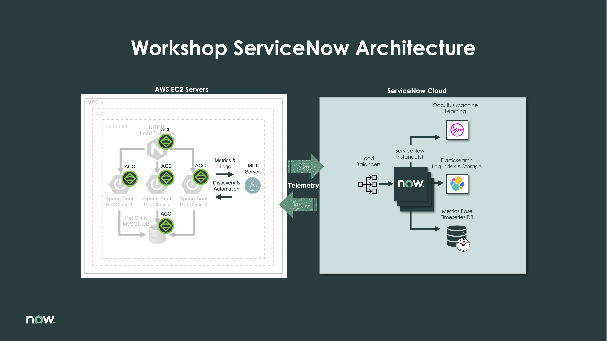

# Introduction

Title | Subtitle | Author | Date
--- | --- | --- | --- 
Predictive AIOps Workshop 1.0 Installation Guide | Predictive AIOps Workshop - I am the I in AI | Anthony Angelo, Netser Heruty, Danny Smith | 10 Nov 2021
**Predictive AIOps Workshop 2.0 Installation Guide** | **Predictive AIOps Workshop - The Rise of the Unified Agent** | **Anthony Angelo, Netser Heruty** | **01 Feb 2022**
_Predictive AIOps Workshop 3.0 #Future Plan#_ | _Predictive AIOps Workshop - Feat. Grafana #No_Time_to_Glide_ | _Anthony Angelo, Netser Heruty, Karlis Peterson_ | _July 2022?_

# Introduction

The heracles-docs repo provides prescriptive guidance for deploying the Predictive AIOps Workshop environment (both the monitored app, and the ServiceNow instance). The overall Predictive AIOps Workshop Architecture consists of several AWS EC2 servers conforming to a typical N-Tier web application, complete with a Load Generator and Chaos Simulator. The core application is the Spring Pet Clinic which is based on Java Spring Boot and requires the use of a Database for persistence.

On the ServiceNow side, we provide the full **ITOM Health** exprience with ACC, HLA, MI & EM (plus ITOM Visiblity! with Discovery & Service Mapping complementing the entire setup). Each of the CI's in the environment is fully monitored by the _Agent Client Collector (ACC, AKA: ITOM Agent, Unified AIOps Agent)_, which runs basic discovery and collects all the observability data from the app, using:
* The ACC-M plugin for Monitoring - leveraging checks execution directly against the CI to create **Events**, and **Metrics** collection in real-time, to be analyzed by Metric Intelligence (MI);
* The ACC-L plugin for Log Analytics - collecting all the **Logs** from the application's components and infrastructure, to be analyzed and searched for anomalies in real-time by the _Health Log Analytics (HLA)_ AI Engine.

Finally, it all comes together with _Event Management (EM)_ correlating the alerts, while also leveraging CMDB relationships.

