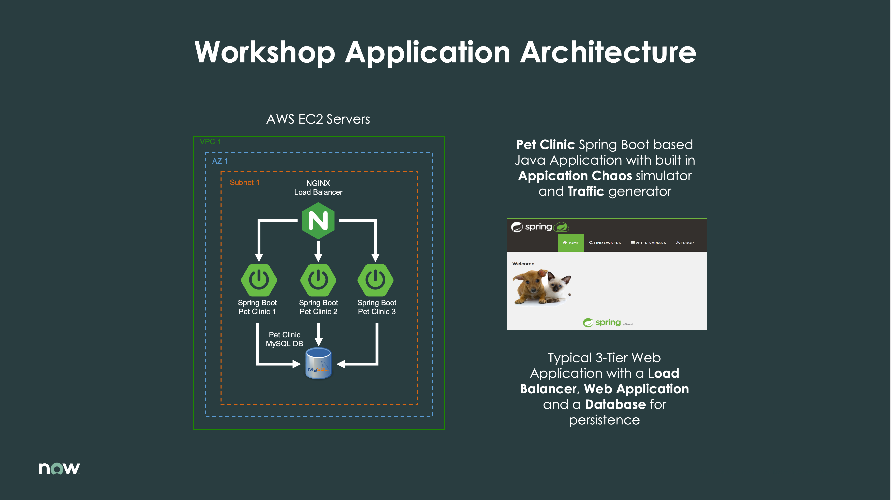

# Introduction

This document describes at a high-level the Predictive AIOps Workshop Architecture, Design decisions as well as a brief Release History.

# Workshop Application Architecture

The overall Predictive AIOps Workshop Architecture (see diagram below) consists of several AWS EC2 servers conforming to a typical N-Tier web application, complete with a Load Generator and Chaos Simulator. The core application is the Spring Pet Clinic which is based on Java Spring Boot and requires the use of a Database for persistence.

# Workshop ServiceNow Architecture

On the ServiceNow side, we provide the full ITOM Health experience leveraging the latest Agent Client Collector (ACC), Health Log Analytics (HLA), Metric Intelligence (MI), Event Managment (EM) as well as ITOM Visiblity with Discovery and Service Mapping (see diagram below). Each of the Configuration Items (CI's) in the environment is fully monitored by ACC which runs basic discovery and collects all the observability data from the apps.

# Unified AIOps Agent

The Predictive AIOps Workshop leverages the latest version of ACC, which unifies the legacy functions of our Monitoring Agent (ACC-M) together with log collection, simplifying the deployment.

ACC is built on the [Sensu.io](https://sensu.io) framework and comes installed with monitoring capabilities for servers, databases, application servers, and middleware. Sensu based checks and policies run in the ACC agent to retrieve the relevant data, which is transformed into events or metrics which are analyzed in real-time by the Metric Intelligence capability. 

This latest ACC release removes the need for a separate 3rd party agent to collect log files (e.g., Filebeat) reducing complexity. Log files from your application components and infrastructure are streamed into ServiceNow and analyzed in real-time by Health Log Analytics which is constantly looking for anomalies and alerting users when they are detected. 

Alerts are continuously scanned by Event Management and correlated using temporal or lexical heuristics, or processed by leveraging relationships defined in the Configuration Management Database (CMDB).

# Release History

| Release | Release Notes |
| ------- | ------------- |
| 1.0.0   | Pilot release | 
| 1.0.1   | Feedback from Canadian Rail, Edward Jones, Sabre, Opportun & EMEA |
| 1.0.2   | Feedback from Sentinel Workshops |
| 2.0.0   | Upgrade to latest ACC |